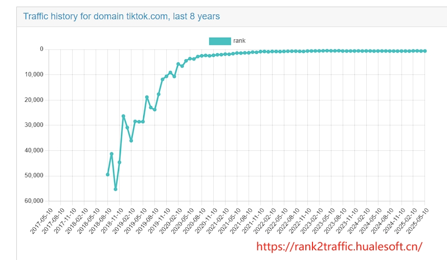

# rank2traffic
web rank web rank history Traffic Rank

## [rank2traffic](#rank2traffic)
 

## rank2traffic  

Traffic and Rank history 
By querying the website ranking changes over the years through web gateways (such as the Rank2Traffic platform, URL: https://rank2traffic.hualesoft.cn/webrank/rank2traffic), we can systematically analyze the website operation dynamics of competitors and provide key data support for optimizing our own website strategies. The following explanations are presented from three aspects: core value, operational logic, and application scenarios:
I. Core Value: Data-Driven Multidimensional Competitive Analysis
1.	Long-Term Trend Insight
By tracking 5-8 years of historical ranking data, we can visually present the natural traffic ranking fluctuations of competitors' websites on search engines (such as Google and Baidu), and identify their upward cycles, decline nodes, and stable intervals. For example, if a competitor's website ranking significantly improved in Q3 2022, we can deduce the effectiveness of its optimization strategies by combining factors such as content update frequency and backlink construction scale during the same period.
2.	Traffic Structure Decomposition
The platform supports granular analysis, including:

•	Regional Ranking Differences: Compare competitors' ranking performance in different countries/regions to locate their core markets and weak areas;
•	Keyword Ranking Distribution: Capture the evolution trajectory of competitors' high-ranking keywords to determine shifts in their content focus (e.g., from "product reviews" to "industry solutions");
•	Traffic Source Proportions: Analyze changes in the proportion of direct visits, search traffic, and referral traffic to evaluate their brand influence and channel operation effectiveness.

3.	Risk Warning and Opportunity Capture

•	If a competitor's ranking continues to decline (e.g., a drop of over 30% for 12 consecutive months), monitor whether it has been penalized due to algorithm adjustments, declining content quality, or rule-breaking activities, and avoid repeating similar mistakes;
•	When ranking fluctuations occur in industry-leading websites (e.g., domain name changes, structural adjustments), quickly follow up on market gaps to seize traffic dividends.
II. Operational Logic: From Data Collection to Strategy Implementation
1.	Data Acquisition Process

•	Enter competitors' URLs or industry keywords, select a time span (e.g., 2018-2025), and generate visual trend charts (including ranking curves, traffic heat maps, etc.);
•	Export CSV format data reports, which can be cross-analyzed with self-owned operational data (such as conversion rates and bounce rates) to build a multidimensional evaluation model.

2.	Strategy Development Framework
| Analysis Dimension | Data Indicator Examples | Operational Optimization Directions |
|--------------------------|-----------------------------------|-----------------------------------------------------------------------------------------------------|
| Ranking Stability | Annual volatility coefficient, Top 100 days percentage | If volatility is high, investigate technical issues (e.g., server response speed) or content update regularity |
| Keyword Competitiveness | Growth rate of high-ranking keywords | Rapidly produce substitute content for competitors' declining keywords (e.g., keywords with decreasing search volume but still high rankings) |
| Backlink Quality | Growth trend of high-quality domain backlinks | Imitate competitors' high-authority backlink sources (e.g., industry media collaborations) to enhance self-website authority |
| User Experience | Mobile vs. PC ranking differences | Prioritize optimizing responsive design or AMP page loading speed if mobile rankings lag |
III. Application Scenarios: Decision Support for Full-Cycle Operations
1.	New Website Cold Start Phase
Analyze the historical ranking growth curves of industry TOP 10 websites, extract their initial content strategies (e.g., frequent publication of long-tail keyword articles), and formulate a "ranking climb" plan adapted to self-owned resources.
2.	Mature Website Iteration Period
Compare self-owned and competitors' ranking performances during algorithm update cycles (e.g., Google core algorithm updates), verify the risk resistance of existing optimization plans, and adjust technical optimization priorities (e.g., prioritize fixing crawler errors or improving page loading speed).
3.	Marketing Activity Evaluation
Combine marketing nodes (e.g., e-commerce promotions, new product launches) to monitor the linkage effect between website rankings and traffic during activities, and evaluate the actual impact of content marketing (e.g., press releases, short video embeds) on natural search rankings.
IV. Extended Value: Cross-Industry Data Migration Reference
In addition to direct competitors, expand the analysis to ranking evolution logic of cross-industry benchmark websites (e.g., platforms with the same audience but different categories). For example, education industry websites can reference e-commerce websites' keyword layout strategies during promotions to improve search visibility through content such as "limited-time offers" and "user cases".

Visit Now: Rank2Traffic platform, enter the target URL to unlock up to 8 years of historical data insights, making website operation strategies more precise and predictable.

